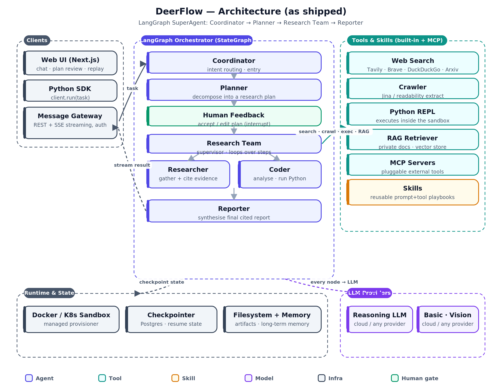
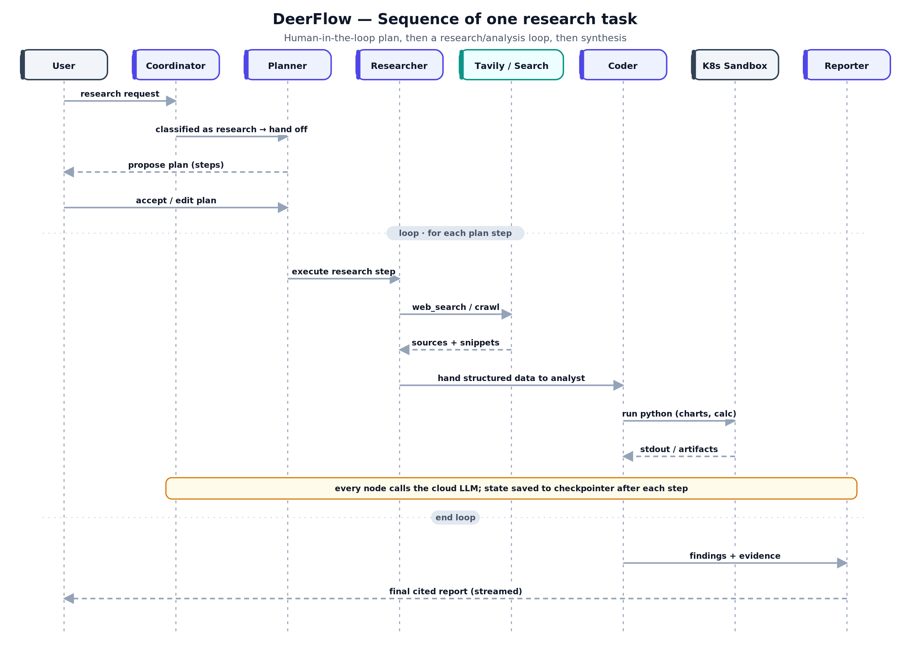
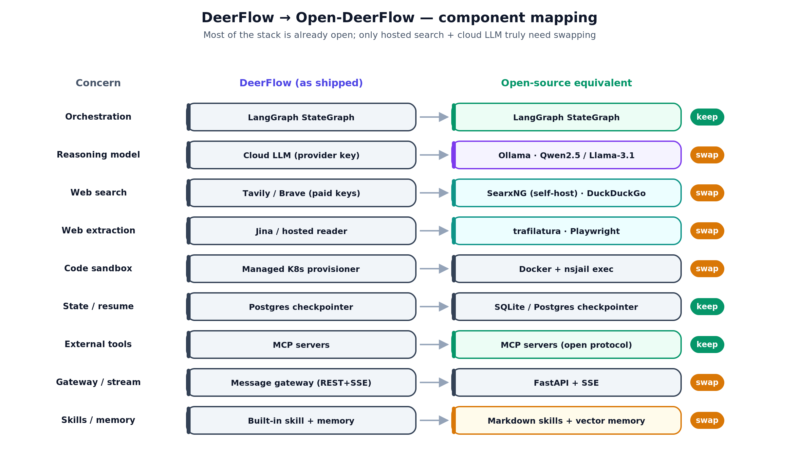
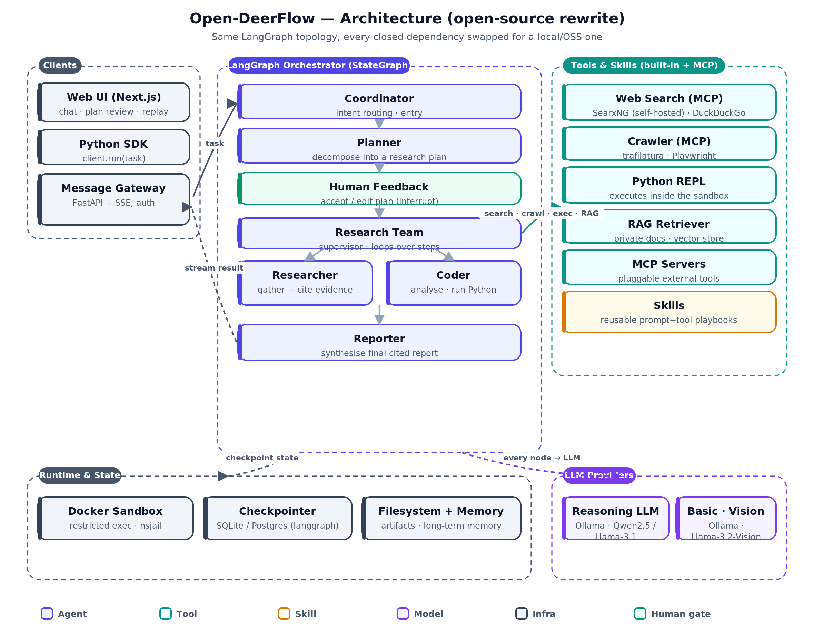
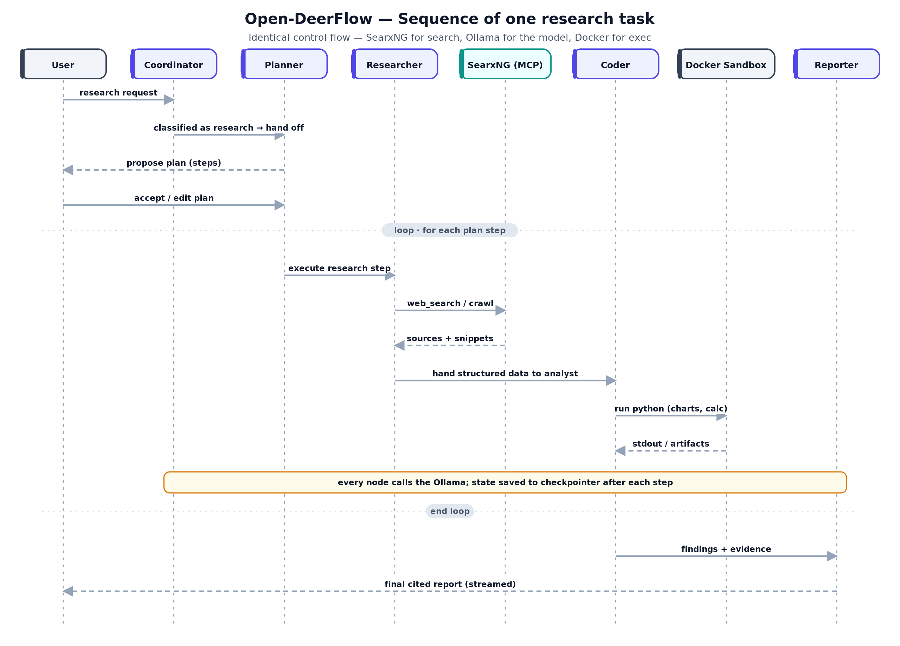

# DeerFlow, rebuilt in the open

### How a LangGraph "SuperAgent" actually works — and how to run one with zero cloud keys

> This article is part of a series that takes a trending AI repository (spotted by
> [Gittyboy](https://github.com/batlabx/gittyboy)) and does two things: explains the design *only through
> pictures and code*, then rebuilds it as a fully open-source stack. This one is about
> **[bytedance/deer-flow](https://github.com/bytedance/deer-flow)** — an open-source, long-horizon agent
> harness that researches, codes, and writes. The working rewrite lives in [`src/`](src/open_deerflow); every diagram is reproducible from [`diagrams/`](diagrams).

---

## 1. The problem it solves

Most AI agents are sprinters. You give them a prompt, they think for a few seconds, they hand back an answer. That works beautifully for "summarise this email" and falls apart the moment the task is *long*: research the market for a category, read forty sources, run a benchmark, cross-check the numbers, and write a cited report. Those tasks take **minutes to hours**, not seconds, and they break single-shot agents in four specific ways:

- **Context runs out.** Forty sources do not fit in one window. Something has to gather, compress, and discard as it goes.
- **The work is parallel.** Ten independent research threads should not run one-after-another at the speed of the slowest.
- **Code has to run — safely.** "Benchmark each option" means executing untrusted, model-written code without letting it touch your machine.
- **Interruptions are fatal.** If a two-hour run dies at minute 90, you cannot afford to start over.

DeerFlow (ByteDance's "Deep Exploration and Efficient Research flow") is a production-grade answer to all four. It is a **LangGraph state machine** that decomposes a task into a plan, spawns specialised sub-agents, runs their code in sandboxes, checkpoints its state after every step, and streams the result to a web UI or a Python client. It is one of the most-starred open agent frameworks of the year precisely because it is the *complete* pattern, not a toy.

### Practical use cases

| You want to… | DeerFlow does this by… |
|---|---|
| **Produce a cited deep-research report** ("compare the top 5 OSS inference engines") | fanning out parallel `researcher` sub-agents, each searching + reading sources, then a `reporter` synthesises with citations |
| **Run an analysis that needs real computation** ("benchmark each option and chart it") | handing structured data to a `coder` sub-agent that writes and executes Python in a sandbox |
| **Do competitive / market intelligence** | querying many sources (web, docs, APIs via MCP) and returning a structured brief |
| **Drive a content pipeline** (research → outline → draft → assets) | chaining nodes so each stage's output becomes the next stage's input |
| **Automate a recurring analyst task on a schedule** | resuming from a checkpoint, so long jobs survive restarts and can run unattended |

The through-line: **any task that is too long or too multi-step for one prompt, but still needs to end in a single, trustworthy deliverable.**

---

## 2. How it works, in pictures

The best one-sentence description of DeerFlow is a control-flow graph: a **Coordinator** decides if the task is real research; a **Planner** breaks it into steps; a **human approves the plan**; a **Research Team** supervisor dispatches each step to a **Researcher** or a **Coder**; and a **Reporter** writes the final answer. Everything else — search, crawling, code execution, memory — hangs off those nodes as tools and infrastructure.

### Architecture



Three things are worth reading off that diagram:

1. **The orchestrator is a LangGraph `StateGraph`.** Nodes are the boxes in the middle. They don't call each other directly; each node returns a `Command` that says "update the state like *this*, then go to *that* node." That is what makes the topology dynamic — the graph reshapes itself at runtime based on the plan.
2. **Tools are separate from agents.** Web search, crawling, the Python REPL, RAG, and any pluggable **MCP** server live in their own column. Agents *call* them; they don't contain them.
3. **State and runtime are cross-cutting.** Every node talks to the LLM tier and writes to the checkpointer, so a run can pause (for the human) or crash (and resume) without losing progress.

### The agents, tools, and skills

| Kind | Name | Responsibility |
|---|---|---|
| 🟦 Agent | **Coordinator** | Classify the task; reject non-research requests cheaply |
| 🟦 Agent | **Planner** | Decompose the task into typed, ordered steps |
| 🟩 Human gate | **Human Feedback** | Accept or edit the plan before any tool runs (a LangGraph *interrupt*) |
| 🟦 Agent | **Research Team** | Supervisor loop: dispatch the next step, or finish |
| 🟦 Agent | **Researcher** | Gather + cite evidence using search/crawl/RAG |
| 🟦 Agent | **Coder** | Analyse data / run Python in the sandbox |
| 🟦 Agent | **Reporter** | Synthesise the final, cited report |
| 🟩 Tool | **Web Search / Crawler / Python REPL / RAG / MCP** | Effectful capabilities the agents invoke |
| 🟧 Skill | **Playbooks** | Reusable prompt+tool recipes (how to plan, how to report) |

### Sequence of a single run

Static boxes don't show the *loop*. This does:



Note the shape: a **human-in-the-loop plan gate** up front, then a **research/analysis loop** that repeats per plan step (search → read → hand to analyst → run code), and finally a **single synthesis** into the report. The orange bar is the invariant that makes long runs survivable: *every node calls the model and every step is checkpointed.*

---

## 3. How to build an open-source version

Here is the punchline that surprises people: **DeerFlow is already ~80% open-source.** LangGraph, LangChain, MCP, and the Postgres checkpointer are all open. What actually ties a deployment to the cloud is a short list — the **LLM behind a provider key** and the **hosted search API** — plus a couple of managed conveniences (a Kubernetes sandbox provisioner, a hosted web reader).

So "build an open-source version" is really "swap the four closed dependencies and keep the architecture." Here's the map:



The rewiring, concretely:

- **Cloud LLM → Ollama.** Point both model tiers at a local [Ollama](https://ollama.com) server (`qwen2.5:14b` for reasoning, `llama3.1:8b` for routing). One env var.
- **Tavily/Brave → SearxNG.** Run a self-hosted [SearxNG](https://github.com/searxng/searxng) meta-search (Docker one-liner) and expose it as an MCP tool. If it's down, fall back to keyless DuckDuckGo — so the tool works with *zero* setup.
- **Hosted reader → trafilatura.** The best open-source boilerplate remover turns any URL into clean text locally.
- **Managed K8s sandbox → Docker.** `docker run --network none --memory 512m` gives you the same isolation guarantees on one machine.

Everything else — the graph, the checkpointer, the MCP protocol, the message gateway (now FastAPI + SSE) — stays. That is the whole thesis: **the value of DeerFlow is the *pattern*, and the pattern is portable.**

### The open-source architecture

Same shape, different substrate. Compare this to the diagram in §2 — the boxes in the middle are *identical*; only the right-hand tools and bottom-row runtime changed colour:





The sequence diagram is deliberately unchanged in structure: swapping SearxNG for Tavily and Ollama for a cloud model does **not** alter the control flow. That's the payoff of keeping capabilities behind a clean interface.

---

## 4. The code, line by line

The full package is in [`src/open_deerflow`](src/open_deerflow). Below are the pieces that carry the ideas. (Layout: `agents/` are graph nodes, `tools/` are standalone MCP servers, `skills/` are Markdown playbooks.)

### 4.1 The shared state — the "single source of truth"

LangGraph passes one object between nodes. Reducers like `add_messages` make a field *append* instead of *overwrite*.

```python
# src/open_deerflow/state.py
class Step(TypedDict):
    id: int
    description: str
    agent: str          # "researcher" | "coder"
    done: bool
    result: str

class DeerState(TypedDict):
    task: str                                 # the user's original request
    messages: Annotated[list, add_messages]   # running chat log (append-only)
    plan: list[Step]                          # the (possibly human-edited) plan
    plan_approved: bool                       # gate set by human_feedback
    cursor: int                               # index of the step being executed
    observations: list[str]                   # evidence accumulated by the team
    final_report: str                         # filled in by the reporter
```

### 4.2 The model swap lives in one function

Nothing else in the codebase knows the model isn't in the cloud. Change the provider here and the whole system follows.

```python
# src/open_deerflow/config.py
def get_llm(tier: str = "reasoning"):
    if CONFIG.llm.provider == "ollama":
        from langchain_ollama import ChatOllama
        model = (CONFIG.llm.reasoning_model if tier == "reasoning"
                 else CONFIG.llm.basic_model)
        return ChatOllama(model=model, base_url=CONFIG.llm.base_url,
                          temperature=CONFIG.llm.temperature)
    raise ValueError(f"Unsupported provider: {CONFIG.llm.provider}")
```

### 4.3 A tool — `web_search` as an MCP server

This is the search capability. It tries self-hosted SearxNG, then falls back to keyless DuckDuckGo. Crucially it is a **standalone MCP server**: the same file works from this graph, from Claude Desktop, or from Cursor.

```python
# src/open_deerflow/tools/search_server.py
mcp = FastMCP("open-deerflow-search")
SEARXNG_URL = os.getenv("SEARXNG_URL", "http://localhost:8080")

@mcp.tool()
def web_search(query: str, max_results: int = 6) -> list[dict]:
    """Search the web. Returns a list of {title, url, snippet}."""
    try:                                            # 1) private, unlimited, free
        resp = httpx.get(f"{SEARXNG_URL}/search",
                         params={"q": query, "format": "json"}, timeout=15)
        resp.raise_for_status()
        hits = resp.json().get("results", [])[:max_results]
        if hits:
            return [{"title": h.get("title"), "url": h.get("url"),
                     "snippet": h.get("content", "")} for h in hits]
    except Exception:
        pass                                        # SearxNG down -> fall through
    from ddgs import DDGS                            # 2) keyless fallback
    with DDGS() as ddg:
        return [{"title": h["title"], "url": h["href"], "snippet": h["body"]}
                for h in ddg.text(query, max_results=max_results)]

if __name__ == "__main__":
    mcp.run()                                       # stdio transport
```

### 4.4 An agent — the Researcher

An "agent" here is nothing more than *an LLM + a prompt + a set of tools*. The tools are injected at build time, so this node has no idea SearxNG or MCP exist — it just calls `web_search`.

```python
# src/open_deerflow/agents/researcher.py
def make_researcher(tools):
    agent = create_react_agent(get_llm("reasoning"), tools=tools,
                               prompt=RESEARCHER_PROMPT)

    def researcher(state) -> Command:
        step = state["plan"][state["cursor"]]
        result = agent.invoke({"messages": [("user", step["description"])]})
        answer = result["messages"][-1].content
        plan = state["plan"]
        plan[state["cursor"]]["done"] = True
        plan[state["cursor"]]["result"] = answer
        return Command(goto="research_team",             # return to the supervisor
                       update={"plan": plan,
                               "observations": state["observations"] + [answer]})
    return researcher
```

The **supervisor** that dispatches to it is deliberately tiny — it owns no model, it just routes:

```python
# src/open_deerflow/agents/research_team.py
def research_team(state) -> Command:
    for step in state["plan"]:
        if not step["done"]:
            goto = "coder" if step["agent"] == "coder" else "researcher"
            return Command(goto=goto, update={"cursor": step["id"]})
    return Command(goto="reporter")     # all steps done -> synthesise
```

### 4.5 A skill — the Reporter's playbook

The Reporter calls **no tools**. Its behaviour is governed by a *skill*: a Markdown file loaded at runtime.

```python
# src/open_deerflow/agents/reporter.py
def reporter(state) -> Command:
    llm = get_llm("reasoning")
    evidence = "\n\n---\n\n".join(state["observations"]) or "(no evidence)"
    prompt = REPORTER_PROMPT.format(
        skill=load_skill("report_writing"),   # <- editable Markdown playbook
        task=state["task"], evidence=evidence)
    return Command(goto=END, update={"final_report": llm.invoke(prompt).content})
```

### 4.6 Assembling the graph

Only **one** edge is static (`START → coordinator`). Every other transition is decided by the `Command(goto=...)` a node returns, which is why this file is so short:

```python
# src/open_deerflow/graph.py
def build_graph(checkpointer=None):
    tools = _load_mcp_tools()                        # launches the 3 MCP servers
    research_tools = [t for t in tools if t.name in ("web_search", "read_url")]
    code_tools     = [t for t in tools if t.name == "python_exec"]

    g = StateGraph(DeerState)
    g.add_node("coordinator", coordinator)
    g.add_node("planner", planner)
    g.add_node("human_feedback", human_feedback)
    g.add_node("research_team", research_team)
    g.add_node("researcher", make_researcher(research_tools))
    g.add_node("coder", make_coder(code_tools))
    g.add_node("reporter", reporter)
    g.add_edge(START, "coordinator")                 # the only static edge
    return g.compile(checkpointer=checkpointer)
```

### Why is something a *tool* and not a *skill*?

This is the single most useful distinction when you design an agent system, and the two files above are the clean contrast:

| | **Tool** (`web_search`, `python_exec`) | **Skill** (`report_writing.md`) |
|---|---|---|
| Has an API boundary? | **Yes** — typed inputs → typed outputs | No — it's prose |
| Side effects? | **Yes** — network, filesystem, code execution | None |
| How the model uses it | The model **calls** it and reads the return value | The model **reads** it to shape its reasoning |
| Who edits it | An engineer (it's code) | A domain expert (it's Markdown) |
| Where it should live | Behind **MCP**, so any client can reuse it | In a file the model loads at runtime |

Rule of thumb: **if it touches the outside world or must return a verifiable value, it's a tool — put it behind MCP. If it's knowledge about *how to think*, it's a skill — keep it as editable text.** Search is a tool because "did we actually hit the internet and get results?" is verifiable. "How to structure a report" is a skill because it has no correct return value — only better or worse prose.

---

## Run it yourself

```bash
pip install -e .                      # install the package
docker compose up -d                  # optional: self-hosted SearxNG search
ollama pull qwen2.5:14b-instruct      # the reasoning model
python -m open_deerflow.main "Compare the top 3 open-source vector databases in 2026"
```

The run prints the plan, waits for your approval (pass `--interactive`), then streams the research/analysis loop and the final cited report. Everything runs on your machine.

---

*Architecture and control flow described here reflect DeerFlow's documented, real design (LangGraph coordinator → planner → research team → reporter). Momentum figures and version specifics originate from the auto-generated Gittyboy brief and are not independently verified. Code in this repo is a compact educational reimplementation, not ByteDance's source.*
